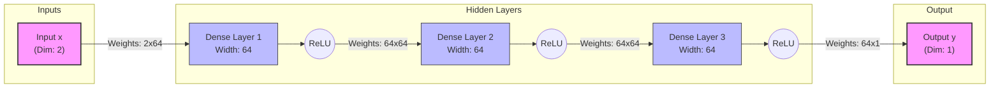

## Neural Network Architecture - Rosenbrock Surrogate ($D$ Dimensions)

```mermaid
graph LR
    subgraph Inputs
        I["Input x <br/> (Dim: 2)"]
    end

    subgraph Hidden [Hidden Layers]
        H1["Dense Layer 1 <br/> Width: 64"]
        A1(("ReLU"))
        H2["Dense Layer 2 <br/> Width: 64"]
        A2(("ReLU"))
        H3["Dense Layer 3 <br/> Width: 64"]
        A3(("ReLU"))
    end

    subgraph Output
        O["Output y <br/> (Dim: 1)"]
    end

    I -->|"Weights: 2x64"| H1
    H1 --> A1
    A1 -->|"Weights: 64x64"| H2
    H2 --> A2
    A2 -->|"Weights: 64x64"| H3
    H3 --> A3
    A3 -->|"Weights: 64x1"| O

    style I fill:#f9f,stroke:#333,stroke-width:2px
    style O fill:#f9f,stroke:#333,stroke-width:2px
    style H1 fill:#bbf,stroke:#333
    style H2 fill:#bbf,stroke:#333
    style H3 fill:#bbf,stroke:#333
```